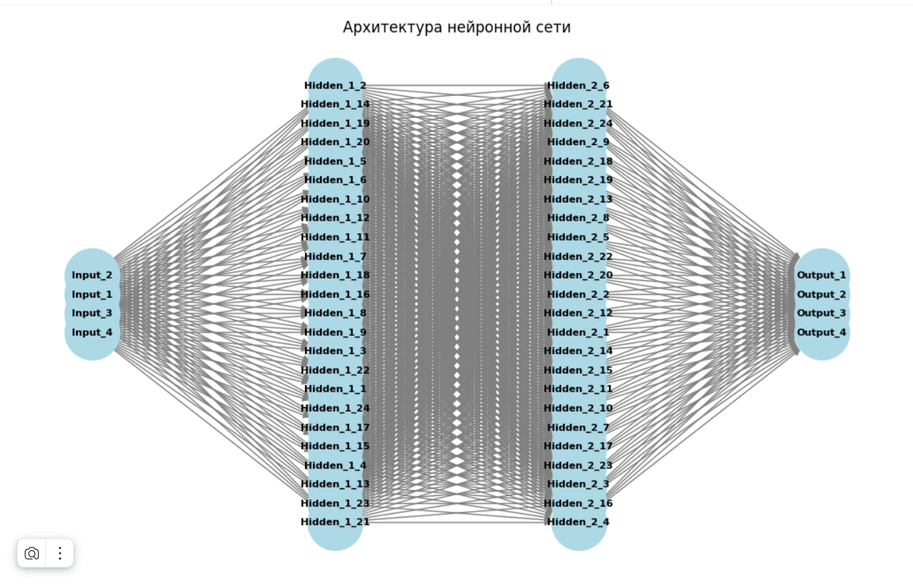

# DeepEcoHome

> Система оптимизации энергопотребления умного дома на базе Deep Q-Learning




## 🟢 Описание проекта
Этот проект посвящен созданию интеллектуальной системы управления энергопотреблением в жилом пространстве с целью экономии ресурсов и снижения эксплуатационных расходов посредством технологий глубокого обучения.

Система, использующая алгоритм Deep Q-Learning, автоматически регулирует работу домашних электроприборов, обеспечивая оптимальное распределение электрической нагрузки и экономию бюджета владельца.

[Ссылка на проект Colab](https://colab.research.google.com/drive/1OGb78XuiQue4ShaIkMkO7PlB9RedoXPh?usp=sharing)

## 🟢 Технологический стек

| Компонент | Технология |
|-----------|------------|
| Язык | Python 3.12 |
| ML-фреймворк | TensorFlow / Keras |
| Обучение с подкреплением | Deep Q-Network (DQN) |
| Визуализация | Matplotlib, Seaborn |
| Математика | NumPy |

## 🟢 Ключевые навыки

- **Reinforcement Learning** — обучение с подкреплением
- **Deep Q-Network (DQN)** — архитектура нейросети
- **TensorFlow / Keras** — построение и обучение моделей
- **Нейронные сети** — полносвязные слои
- **Оптимизация** — математическая оптимизация энергопотребления

## 🟢 Возможности

- Обучение агента управлять электроприборами
- Учёт тарифных зон (день/ночь)
- Ограничения по мощности
- Адаптация к поведению жильцов
- Визуализация процесса обучения

## 🟢 Результаты

| Метрика | Значение |
|---------|----------|
| Экономия электричества | до 25% |
| Сокращение перегрузок | да |
| Автоматизация | полная |

## 🟢 Структура проекта

```
DeepEcoHome/
├── main.py                 # Точка входа
├── model/
│   ├── agent.py            # DQN-агент
│   ├── train.py            # Обучение
│   └── env.py              # Симуляция среды
├── visualization/
│   ├── analysis.py         # Анализ результатов
│   └── plots.py            # Графики
├── requirements.txt
└── images/
```

## 🟢 Быстрый старт

```bash
git clone https://github.com/lamauspex/DeepEcoHome.git
```
```bash
cd DeepEcoHome
```
```bash
pip install -r requirements.txt
```
```bash
python main.py
```

## 🟢 Архитектура DQN

```
State → [Dense 128] → [Dense 64] → Q-Values → Action
         (ReLU)        (ReLU)       (Linear)
```

Агент получает состояние (время, тариф, нагрузка) и предсказывает Q-значения для действий (включить/выключить прибор).

---

**Автор**: Резник Кирилл  
**Email**: lamauspex@yandex.ru  
**Telegram**: @lamauspex
